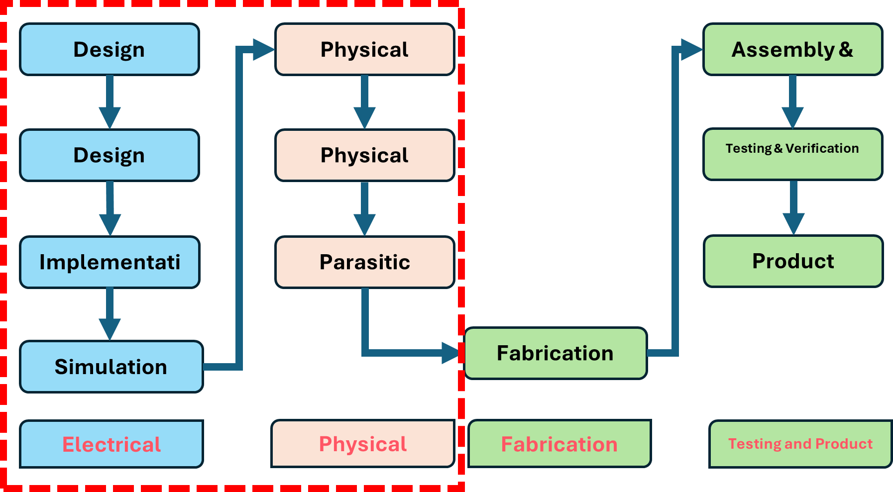
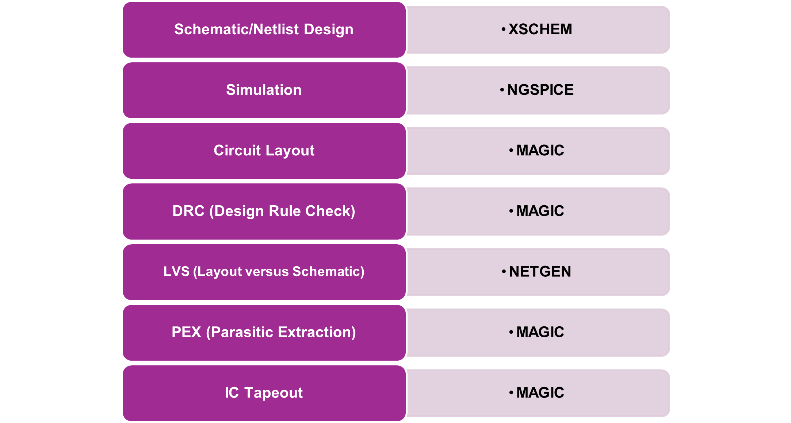
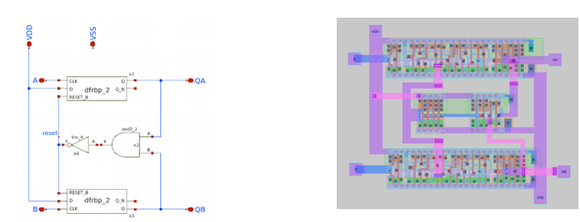
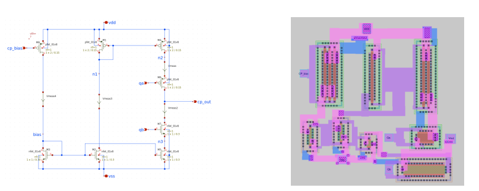
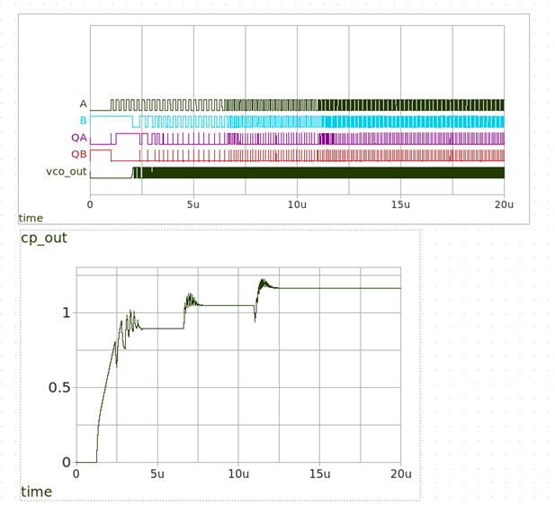
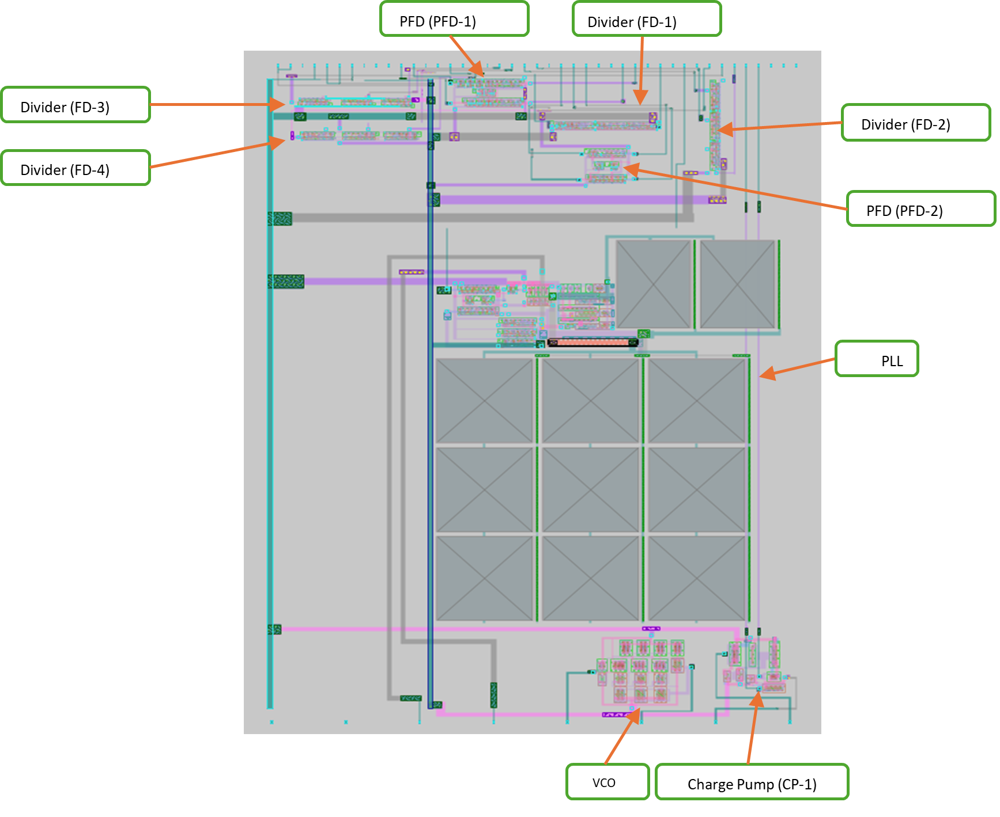

# PLL Design for Tiny Tapeout-06

April 2024

---

## Contents

1. [Introduction](#introduction)
2. [Analog IC Design Flow](#analog-ic-design-flow)
3. [EDA Tool Flow](#eda-tool-flow)
4. [PLL Blocks](#pll-blocks)
   - [Phase Frequency Detector (PFD)](#phase-frequency-detector-pfd)
   - [Charge Pump & Loop Filter](#charge-pump--loop-filter)
   - [Voltage Controlled Oscillator (VCO)](#voltage-controlled-oscillator-vco)
   - [Frequency Divider](#frequency-divider)
5. [Complete PLL Circuit](#complete-pll-circuit)
6. [Final Designs Integrated in Tiny Tapeout-06](#final-designs-integrated-in-tiny-tapeout-06)

---

## Introduction

Phase-Locked Loops (PLLs) are crucial components in integrated circuits (ICs), widely used for frequency synthesis and clock generation. They synchronize an output signal’s phase and frequency with a reference signal, enabling their application in communication systems, microprocessors, and mixed-signal circuits.

A 10-week training program was held in January 2024, attended by over 90 students from colleges and universities across KSA. The program included six online lectures demonstrating various steps in analog IC design. Participants were supported through a Slack community platform for queries and one-on-one meetings.

This document covers the design of a PLL circuit using open-source Electronic Design Automation (EDA) tools and the Skywater 130nm (Sky130) Process Design Kit (PDK). The PLL design is divided into four key sub-blocks:

- **Phase Frequency Detector (PFD):** Identifies phase and frequency differences between the reference and feedback signals.
- **Charge Pump:** Converts the PFD’s error signal into a current signal to adjust the VCO’s control voltage.
- **Voltage-Controlled Oscillator (VCO):** Generates a frequency proportional to the control voltage.
- **Divider:** Scales down the VCO output frequency to provide feedback to the PFD.

Each sub-block was designed by a dedicated team, integrated to realize the PLL circuit.

---

## Analog IC Design Flow

 <!-- Replace with actual image path -->

1. **Design Concept**  
   Driven by market needs (consumer, defence, industrial, etc.).

2. **Design Definition**  
   Define new circuits (e.g., amplifiers, filters, data converters) for targeted specifications.

3. **Design Implementation**  
   Choose a suitable circuit architecture to meet specifications.

4. **Simulation**  
   Validate the design through SPICE circuit simulation.

5. **IC Layout**  
   Implement the design on silicon using EDA software.

6. **Physical Verification**  
   - **DRC:** Design Rule Check.  
   - **LVS:** Layout vs. Schematic.  
   - **Parasitic Extraction (PEX):** Extract parasitic elements and analyse their impact.

7. **IC Tape-Out**  
   Convert layout into GDSII file format.

8. **Photomask Creation & Fabrication**  
   Lithography and fabrication take 1–3 months depending on foundry.

9. **Dicing, Packaging & Testing**  
   Dies are packaged and tested for functionality and electrical parameters.

10. **Release**  
    IC is qualified and released for application use.

---

## EDA Tool Flow

 <!-- Replace with actual image path -->

1. **Schematic/Netlist Design (XSCHEM)**
2. **Simulation (NGSPICE)**
3. **Circuit Layout (MAGIC)**
4. **DRC (MAGIC)**
5. **LVS (NETGEN)**
6. **PEX (MAGIC)**
7. **IC Tapeout (MAGIC)**

---

## PLL Blocks

### Phase Frequency Detector (PFD)

 <!-- Replace with actual image path -->

Detects phase and frequency differences between signals.  
Key specs:

| Parameter            | Value       |
|-----------------------|-------------|
| Reference Frequency  | 5 MHz       |
| Divided Signal Range | 5–15 MHz    |
| Load Capacitance     | 500 fF      |

Two D-flip-flops store input transitions, an AND gate with inverter generates reset. Buffers drive load capacitors.

---

### Charge Pump & Loop Filter

 <!-- Replace with actual image path -->

Charge pump converts small voltage difference into a current signal, creating a control voltage for the VCO. Loop filter (R-C) smoothens the current into a stable voltage, attenuating noise.

---

### Voltage Controlled Oscillator (VCO)

 <!-- Replace with actual image path -->

A current-starved ring oscillator with tunable frequency. Frequency is determined by inverter delay and current control.

---

### Frequency Divider

 <!-- Replace with actual image path -->

Divide-by-2 block cascaded three times to achieve divide-by-8. Buffers ensure signal integrity for driving capacitive loads.

---

## Complete PLL Circuit

 <!-- Replace with actual image path -->
 <!-- Replace with actual image path -->

**Key Specifications:**

| Parameter            | Value          | Unit |
|-----------------------|----------------|------|
| VDD (Power Supply)   | 1.8            | V    |
| FCLKREF              | 5–10           | MHz  |
| FCLKOUT              | 40–80          | MHz  |
| CL (Load Capacitance) | 5              | pF   |
| IDD (Supply Current) | 20             | µA   |

---

## Final Designs Integrated in Tiny Tapeout-06

 <!-- Replace with actual image path -->

A total of 8 PLL sub-block designs were submitted. Integrated die area: **160 µm × 230 µm**. Sub-blocks:

- Divider (FD-3)
- Divider (FD-4)
- VCO
- Charge Pump (CP-1)
- PLL
- PFD (PFD-2)
- Divider (FD-2)
- Divider (FD-1)
- PFD (PFD-1)

| Parameter | Value | Unit |
|-----------|-------|------|
| VDD | 1.8 | V |
| FCLKREF | 5–10 | MHz |
| FCLKOUT | 40–80 | MHz |
| CL | 5 | pF |
| IDD | 20 | µA |

---

> **Note:** Replace all image placeholders (`images/filename.png`) with actual image paths uploaded to your repo.

---

### ✨ **Next Steps**
- Create a folder `images/` in your repo.  
- Upload all circuit diagrams and layout images there.  
- Paste this Markdown into your `README.md` file.  
- Commit and push to update your GitHub main page.

---

Let me know if you want:
- A **clean GitHub README template** with badges and project info  
- **Instructions to add images via markdown in GitHub**  
- Or **command-line steps** for commit and push.

