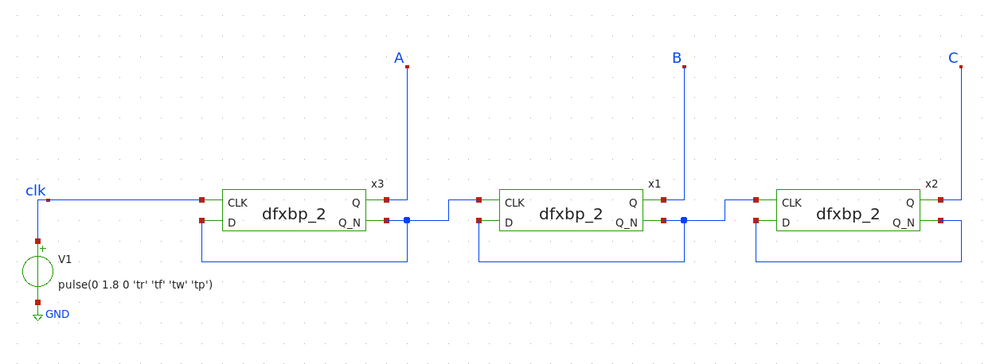

<!---

This file is used to generate your project datasheet. Please fill in the information below and delete any unused
sections.

You can also include images in this folder and reference them in the markdown. Each image must be less than
512 kb in size, and the combined size of all images must be less than 1 MB.
-->

## How it works

This design contains individual blocks used to realize a PLL circuit. These blocks are designed by participants under SSP (Saudi Semicondcutor Program) using open-source analog EDA tools. There are 4 blocks designed by multiple individuals and teams: 

**Phase Frequency Detector (PFD)**: D flip-flop-based phase frequency detector (PFD) with inputs A and B, and outputs QA and QB compares the phases of two input signals, A and B, and generates output pulses to indicate the phase difference between them. When A leads B, the output QA transitions high, while QB transitions low. Conversely, when B leads A, QA transitions low and QB transitions high. If both signals are in phase, neither QA nor QB transitions. PFD's output signals can be used to control the frequency and phase of a voltage-controlled oscillator (VCO) in a PLL system, thereby locking the output frequency and phase to the reference input. This is essential in applications such as clock synchronization, frequency synthesis, and communication systems, ensuring precise timing and synchronization. 

**Charge Pump (CP)**: Charge pump circuit converts the output signals from the PFD into a control voltage for Voltage-Controlled Oscillator(VCO). Charge pump circuit consists of a pair of switches and a capacitor. When the PFD generates a positive pulse, one switch connects the capacitor to a reference voltage, charging it. Conversely, when the PFD generates a negative pulse, the other switch connects the capacitor to ground, discharging it. This creates a control voltage proportional to the phase difference between the input and reference signals. 

**Voltage Controlled Oscillator(VCO)**: A ring oscillator Voltage-Controlled Oscillator (VCO) consists of odd number of inverting stages connected in a ring configuration, generating an oscillating waveform. By controlling the bias voltage of the transistors within the stages, the oscillation frequency can be adjusted. This VCO serves as the controlled oscillator in the PLL, with its frequency locked to the reference signal through the feedback loop. 

**Frequency Divider(FD)**: A D flip-flop frequency divider divides the frequency of VCO output signal by a fixed integer ratio. This division process creates a feedback mechanism that compares the divided output frequency with the reference frequency. The D flip-flop's toggling action divides the frequency by 2/4/8, allowing for frequency multiplication or division within PLL loop. 

| | Designer Name           | Block Name               |
|-| ------------------------| ------------------------ |
|1| Abdulrahman Alghamdi    | Frequency Divider (FD-1) |
|2| Abdulrahman Alghamdi 	| PFD (PFD-1)              |
|3| Baraa Musa Abdullah 	| PFD (PFD-2)              |
|4| Faisal Tareq 		| Charge Pump (CP-1)       |
|5| Khalid Abdulaziz 	| Frequency Divider (FD-2) |
|6| Khowla Alkhulayfi       | Frequency Divider (FD-3) |
|7| Nawaf                   | VCO                      |
|8| Nawaf			| Frequency Divider (FD-4) |

## How to test

**PFD**s with phase difference between them. Measure the output at QA and QB pins and see the pulses based on +ve or -ve phase difference between signal applied at input pins

**CP**: Apply input pulses at QA and QB input pins of charge pump replicating the output of PFD circuit. Based on whether QA or QB pulses are high, the output of charge pump circuit will demonstrate charging and discharging behaviour respectively. Charging and discharging rate can be controlled by changing bias voltage cp_bias to either increase of decrease current.

**VCO**: Apply a control voltage, vctrl=0.9V to VCO's input and measure the resulting output frequency. Verify that the output frequency varies with the applied control voltage within the specified range i.e. 0.75V to 1V. Check VCO frequency tuning range by sweeping the control voltage across and observing the output frequency response.

**FD**: Input a signal with a frequency (40 to 80MHz range) to input of frequency divider. Measure the output frequency using a oscilloscope. Verify that the output frequency is one-eighth of the input frequency.

## External hardware
2-channel function/waveform generator with varying frequency and pulse time generation.
2-channel Oscilloscope to measure output signal waveforms.

